# RS Experiment 1: map validation report (phase 1 exit)

Generated by `experiments/robustsuite/rs1_map_validation.py` at commit `2d0d624` (uncommitted RS code changes at run time: 0; frozen manifest verified). Generator `rs-gen-0.4`, seed block RS_DIAG, 50 seeds per family. Pre-registration: RS_DESIGN §4.8. **No robot episode was run**: this is the generator, the frozen oracle and pedestrian-only rollouts.

**Status: approved by the researcher on 2026-09-19** (RS_DESIGN, "Approval: map validation report"). Phase 2 may start.

## For the researcher: what to judge

- **Per family, not per cell.** Ticket 08 asks for statistics per cell. The four cells of a family are views of one draw, so their draw statistics are identical and are given once per family. Consistency check: 40 specs regenerated, 0 mismatches.
- **Feasibility.** The most layout draws any one seed needed was 17 (cap 200).
- **Pedestrians.** The pedestrian-only rollouts meet the clearance floors and the speed limit in every family and motion (section 6).
- **Accepted trigger fractions lean early.** f is drawn uniformly on [0.3, 0.7], but the accepted draws per bin of 0.1 are 108 / 62 / 46 / 34 of 250 (section 5). So events happen earlier on the route than a uniform fraction would place them. Why later fractions fail more is not measured here.
- **Blocks with a quick way round** (the ticket 06 question). This is the detour count, not the block-end kinds: in the clutter families every block is bounded by a box at one end or both. Detour under 1 m: open_clutter 5 / 50, rooms 1 / 50, aisles 0 / 50, corridors 1 / 50, dense_clutter 14 / 50.
- **Empty distance bins:** aisles (bin 4) (section 3).

## 1. Acceptance and resampling

Rates are per accepted draw. Acceptance is accepted draws / layout draws. A layout is redrawn after a failed bin, event or pedestrian draw (§4.7, §14.1 item 5).

| family | draws | layout draws | acceptance | max layout draws (cap 200) | bin redraws / draw | event redraws / draw | pedestrian redraws / draw |
|---|---|---|---|---|---|---|---|
| open_clutter | 50 | 134 | 0.37 | 9 | 0.00 | 1.36 | 0.12 |
| rooms | 50 | 119 | 0.42 | 6 | 0.00 | 1.22 | 0.04 |
| aisles | 50 | 67 | 0.75 | 4 | 1.06 | 0.12 | 0.16 |
| corridors | 50 | 89 | 0.56 | 5 | 0.16 | 0.66 | 0.12 |
| dense_clutter | 50 | 187 | 0.27 | 17 | 0.00 | 1.32 | 0.16 |

## 2. Clearance

Five-number summaries: min / p5 / median / p95 / max, in metres. Floors: start and goal 0.6 (§14.1 item 1); everything else 0.45 (r_c).

| family | start/goal | start→goal route | pedestrian routes (block zone included) | spawn start | spawn entry |
|---|---|---|---|---|---|
| open_clutter | 0.61 / 0.62 / 0.73 / 1.10 / 1.19 | 0.45 / 0.45 / 0.46 / 0.48 / 0.52 | 0.45 / 0.45 / 0.45 / 0.45 / 0.45 | 0.46 / 0.46 / 0.63 / 0.97 / 1.67 | 0.45 / 0.45 / 0.45 / 0.48 / 0.53 |
| rooms | 0.60 / 0.62 / 0.76 / 1.04 / 1.18 | 0.45 / 0.45 / 0.46 / 0.47 / 0.48 | 0.45 / 0.45 / 0.45 / 0.45 / 0.45 | 0.47 / 0.47 / 0.71 / 1.35 / 1.67 | 0.45 / 0.45 / 0.45 / 0.48 / 0.62 |
| aisles | 0.60 / 0.61 / 0.67 / 0.81 / 0.83 | 0.45 / 0.45 / 0.46 / 0.72 / 0.82 | 0.45 / 0.45 / 0.45 / 0.45 / 0.45 | 0.46 / 0.47 / 0.68 / 0.98 / 1.15 | 0.45 / 0.45 / 0.45 / 0.48 / 0.54 |
| corridors | 0.60 / 0.60 / 0.68 / 0.77 / 0.84 | 0.45 / 0.45 / 0.46 / 0.48 / 0.49 | 0.45 / 0.45 / 0.45 / 0.45 / 0.45 | 0.46 / 0.47 / 0.59 / 0.84 / 0.89 | 0.45 / 0.45 / 0.45 / 0.47 / 0.49 |
| dense_clutter | 0.60 / 0.62 / 0.70 / 1.01 / 1.11 | 0.45 / 0.45 / 0.45 / 0.48 / 0.53 | 0.45 / 0.45 / 0.45 / 0.45 / 0.45 | 0.46 / 0.50 / 0.67 / 1.14 / 1.48 | 0.45 / 0.45 / 0.45 / 0.51 / 0.53 |

## 3. Passages, routes and distance bins

Structural passages are the doorways (rooms), the aisles and cross-aisles (aisles) and the corridor strips (corridors). For the clutter families, the value is the narrowest gap between two rectangles of a layout. Block passages are at most 3.0 m.

| family | structural passages | block passage | route length | straight distance | pedestrian loop length |
|---|---|---|---|---|---|
| open_clutter | 1.20 / 1.21 / 1.29 / 1.49 / 1.56 | 1.20 / 1.26 / 1.92 / 2.91 / 2.95 | 5.42 / 6.07 / 8.35 / 10.97 / 11.47 | 4.23 / 5.29 / 7.54 / 9.68 / 10.43 | 21.49 / 30.75 / 45.18 / 58.39 / 65.86 |
| rooms | 1.20 / 1.22 / 1.40 / 1.58 / 1.60 | 1.22 / 1.24 / 1.48 / 2.51 / 2.71 | 5.03 / 6.07 / 9.21 / 12.02 / 13.04 | 4.24 / 4.55 / 7.81 / 10.17 / 10.49 | 16.19 / 34.57 / 50.78 / 71.46 / 86.86 |
| aisles | 1.41 / 1.45 / 1.70 / 1.95 / 2.00 | 1.42 / 1.44 / 1.75 / 1.95 / 2.00 | 4.06 / 4.28 / 7.58 / 11.50 / 11.78 | 4.01 / 4.14 / 5.68 / 7.50 / 7.61 | 22.91 / 35.59 / 50.74 / 72.74 / 90.61 |
| corridors | 1.50 / 1.51 / 1.68 / 1.96 / 2.00 | 1.51 / 1.51 / 1.70 / 1.95 / 2.00 | 5.05 / 5.64 / 8.83 / 12.65 / 14.75 | 4.02 / 4.20 / 6.83 / 9.48 / 9.71 | 18.03 / 28.47 / 46.91 / 73.99 / 87.90 |
| dense_clutter | 1.10 / 1.11 / 1.13 / 1.24 / 1.25 | 1.03 / 1.19 / 1.79 / 2.92 / 2.98 | 4.75 / 5.32 / 7.92 / 10.96 / 12.02 | 4.09 / 4.84 / 7.32 / 9.77 / 10.49 | 22.58 / 27.83 / 41.45 / 54.15 / 62.19 |

| family | route / straight (median) | distance bins 4.0–5.5 / 5.5–7.0 / 7.0–8.5 / 8.5–10.5 |
|---|---|---|
| open_clutter | 1.10 | 7 / 11 / 15 / 17 |
| rooms | 1.17 | 11 / 8 / 12 / 19 |
| aisles | 1.23 | 19 / 19 / 12 / 0 |
| corridors | 1.29 | 16 / 10 / 17 / 7 |
| dense_clutter | 1.10 | 6 / 14 / 11 / 19 |

## 4. Cells: pedestrians and events

| cell | pedestrians | event |
|---|---|---|
| open_clutter / static | 0 | – |
| open_clutter / dynamic | 5 | – |
| open_clutter / trigger_block | 5 | block |
| open_clutter / trigger_spawn | 5 + 1 spawned | spawn |
| rooms / static | 0 | – |
| rooms / dynamic | 3 | – |
| rooms / trigger_block | 3 | block |
| rooms / trigger_spawn | 3 + 1 spawned | spawn |
| aisles / static | 0 | – |
| aisles / dynamic | 4 | – |
| aisles / trigger_block | 4 | block |
| aisles / trigger_spawn | 4 + 1 spawned | spawn |
| corridors / static | 0 | – |
| corridors / dynamic | 3 | – |
| corridors / trigger_block | 3 | block |
| corridors / trigger_spawn | 3 + 1 spawned | spawn |
| dense_clutter / static | 0 | – |
| dense_clutter / dynamic | 4 | – |
| dense_clutter / trigger_block | 4 | block |
| dense_clutter / trigger_spawn | 4 + 1 spawned | spawn |
| m0 / anchor | 6 (M0's motion models) | – |

## 5. Triggers and events

The pre-registered ranges are: trigger fraction (0.3, 0.7); block offset (1.5, 2.5) m; block length at most 3.4 m; spawn distance (2.0, 3.0) m. The detour is the oracle path from the trigger centre to the goal with the block in place, minus the same path without it (at r_c).

| family | trigger fraction | block offset | block length | detour | spawn distance |
|---|---|---|---|---|---|
| open_clutter | 0.30 / 0.31 / 0.37 / 0.65 / 0.69 | 1.51 / 1.57 / 2.01 / 2.47 / 2.49 | 1.60 / 1.66 / 2.32 / 3.31 / 3.35 | 0.22 / 0.74 / 2.30 / 4.94 / 6.39 | 2.02 / 2.15 / 2.73 / 2.96 / 2.97 |
| rooms | 0.30 / 0.32 / 0.43 / 0.64 / 0.68 | 1.53 / 1.62 / 2.11 / 2.43 / 2.49 | 1.62 / 1.64 / 1.88 / 2.91 / 3.11 | 0.32 / 1.10 / 6.29 / 11.45 / 12.99 | 2.08 / 2.20 / 2.66 / 2.98 / 2.99 |
| aisles | 0.30 / 0.31 / 0.40 / 0.63 / 0.68 | 1.50 / 1.54 / 1.95 / 2.42 / 2.48 | 1.82 / 1.84 / 2.15 / 2.35 / 2.40 | 1.25 / 1.74 / 6.17 / 12.92 / 14.08 | 2.04 / 2.21 / 2.59 / 2.98 / 3.00 |
| corridors | 0.30 / 0.31 / 0.45 / 0.63 / 0.67 | 1.50 / 1.52 / 1.88 / 2.40 / 2.49 | 1.91 / 1.91 / 2.10 / 2.35 / 2.40 | 0.59 / 2.27 / 6.89 / 10.29 / 12.28 | 2.04 / 2.24 / 2.68 / 2.92 / 2.97 |
| dense_clutter | 0.31 / 0.32 / 0.44 / 0.68 / 0.70 | 1.50 / 1.53 / 2.02 / 2.45 / 2.47 | 1.43 / 1.59 / 2.19 / 3.32 / 3.38 | 0.32 / 0.42 / 1.45 / 3.14 / 4.57 | 2.10 / 2.25 / 2.61 / 2.98 / 2.99 |

| family | trigger fraction per bin 0.3–0.4 / 0.4–0.5 / 0.5–0.6 / 0.6–0.7 | block ends wall-wall / wall-obstacle / obstacle-obstacle | detour < 1 m | variants crossing / head_on | crossing walks of length 0 |
|---|---|---|---|---|---|
| open_clutter | 29 / 10 / 7 / 4 | 0 / 11 / 39 | 5 / 50 | 31 / 19 | 0 / 31 |
| rooms | 19 / 15 / 11 / 5 | 0 / 5 / 45 | 1 / 50 | 27 / 23 | 0 / 27 |
| aisles | 25 / 10 / 8 / 7 | 0 / 4 / 46 | 0 / 50 | 24 / 26 | 0 / 24 |
| corridors | 18 / 15 / 11 / 6 | 0 / 0 / 50 | 1 / 50 | 28 / 22 | 0 / 28 |
| dense_clutter | 17 / 12 / 9 / 12 | 0 / 15 / 35 | 14 / 50 | 26 / 24 | 0 / 26 |

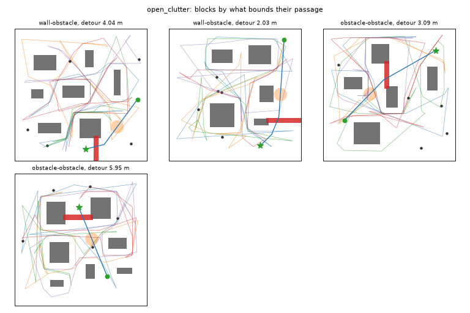

## 6. Pedestrian-only rollouts

Every draw, both motions, 500 steps, no robot. The regular pedestrians are measured against the layout plus the block zone. The spawned one is measured against the static layout (§14.3 item 1). Floors: 0.45 m fixed, 0.3 m randomized (§4.4). The largest step must be at most 0.0675 m.

| family | motion | regular: min clearance | spawned: min clearance | max step |
|---|---|---|---|---|
| open_clutter | fixed | 0.450 | 0.450 | 0.0675 |
| open_clutter | randomized | 0.300 | 0.300 | 0.0675 |
| rooms | fixed | 0.450 | 0.450 | 0.0675 |
| rooms | randomized | 0.300 | 0.300 | 0.0675 |
| aisles | fixed | 0.450 | 0.450 | 0.0675 |
| aisles | randomized | 0.300 | 0.300 | 0.0675 |
| corridors | fixed | 0.450 | 0.450 | 0.0675 |
| corridors | randomized | 0.300 | 0.300 | 0.0675 |
| dense_clutter | fixed | 0.450 | 0.450 | 0.0675 |
| dense_clutter | randomized | 0.300 | 0.300 | 0.0675 |

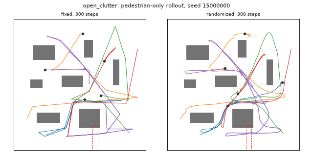

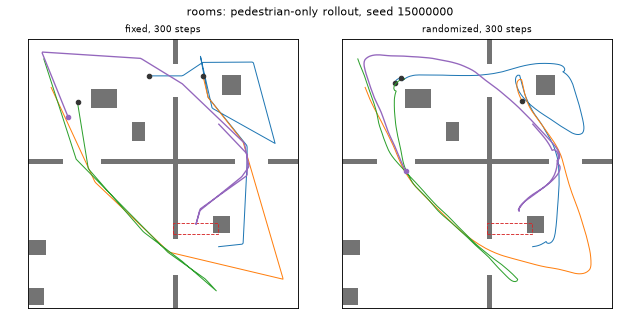

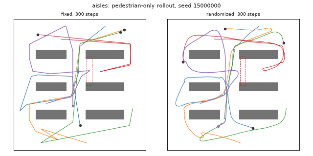

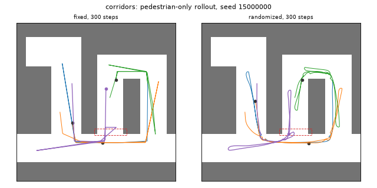

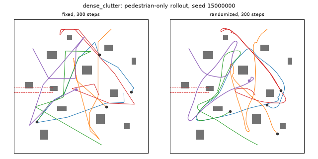

## 7. M0 anchor

M0's own map and stratified sampler on the same 50 seeds. Start and goal are identical in both motions for 50 / 50 seeds. M0 has 6 dynamic obstacles, which pass through its rectangles, as the rollout panels show.

| start/goal clearance | straight distance | route length | distance bins |
|---|---|---|---|
| 0.60 / 0.62 / 0.76 / 0.99 / 1.17 | 4.06 / 4.31 / 6.59 / 9.04 / 9.82 | 4.39 / 4.62 / 7.71 / 10.85 / 12.12 | 14 / 17 / 14 / 5 |

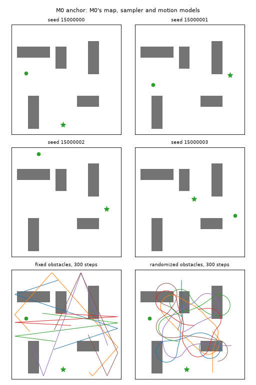

## 8. Rendered samples of every cell

Key to the renders:

- **Grey:** the static layout.
- **Blue:** the start→goal route (A*'s static plan runs close to it). The green dot is the start and the green star is the goal.
- **Thin lines:** pedestrian loops; grey dots are their starts.
- **Dashed red:** the block zone the pedestrians keep clear of (dynamic cells).
- **Solid red:** the fired block.
- **Orange disc:** the trigger.
- **Purple:** the spawn start (×), its scripted entry (thick) and its cycle (dotted).

The block is not drawn in trigger_spawn cells, where it never appears and the spawn ignores it.

### open_clutter / static

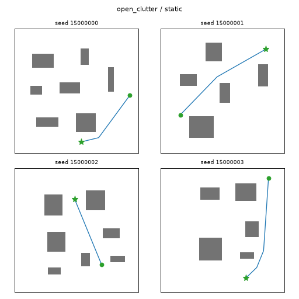

### open_clutter / dynamic

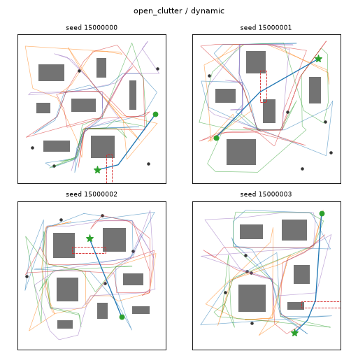

### open_clutter / trigger_block

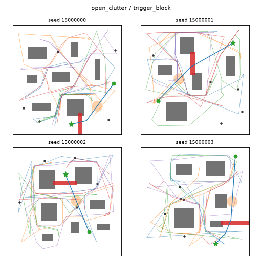

### open_clutter / trigger_spawn

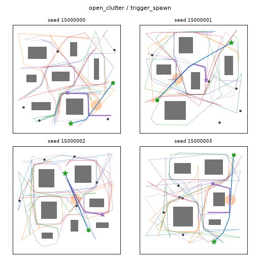

### rooms / static

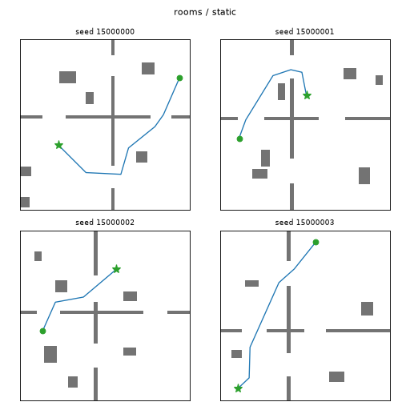

### rooms / dynamic

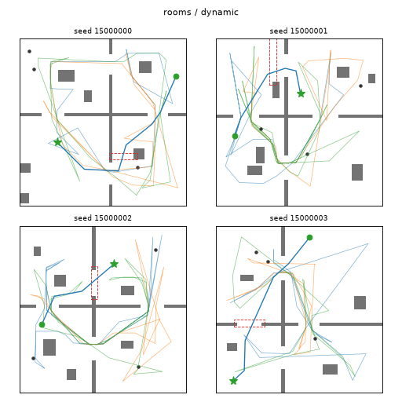

### rooms / trigger_block

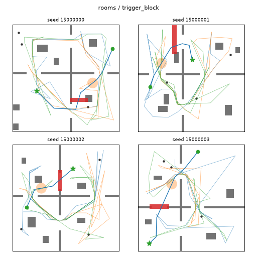

### rooms / trigger_spawn

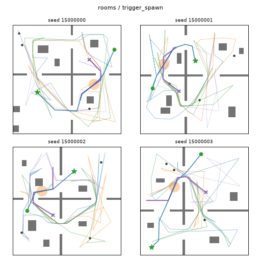

### aisles / static

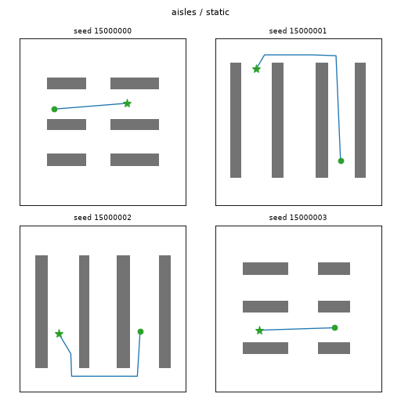

### aisles / dynamic

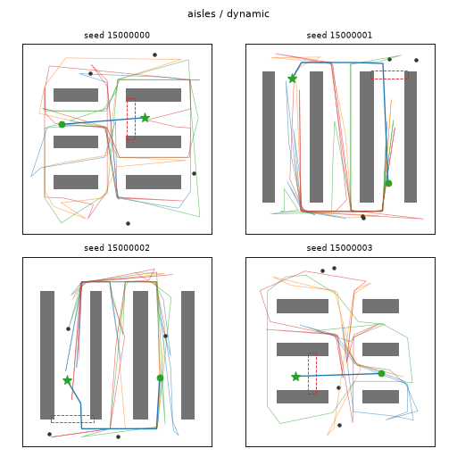

### aisles / trigger_block

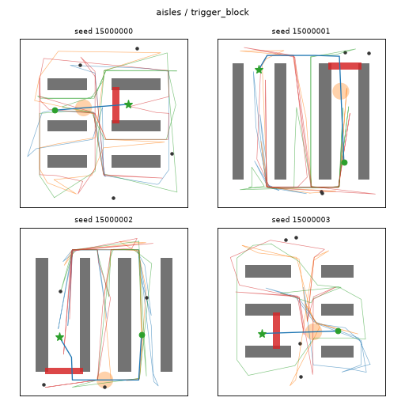

### aisles / trigger_spawn

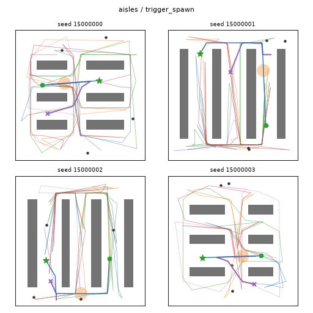

### corridors / static

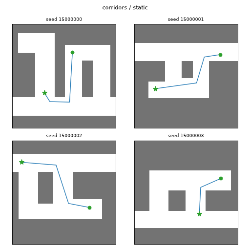

### corridors / dynamic

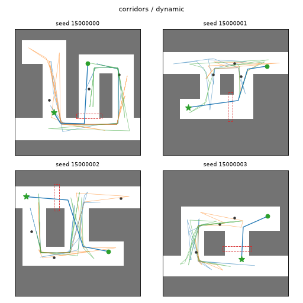

### corridors / trigger_block

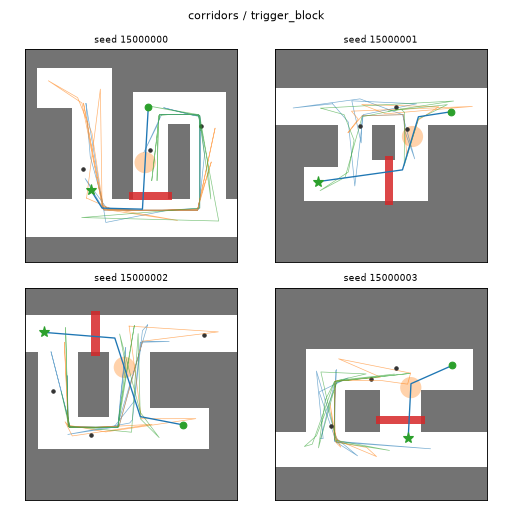

### corridors / trigger_spawn

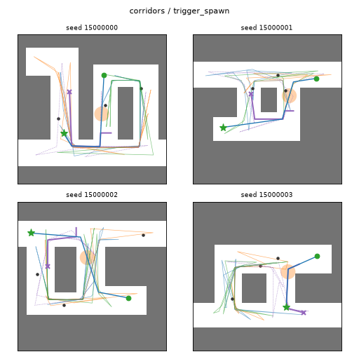

### dense_clutter / static

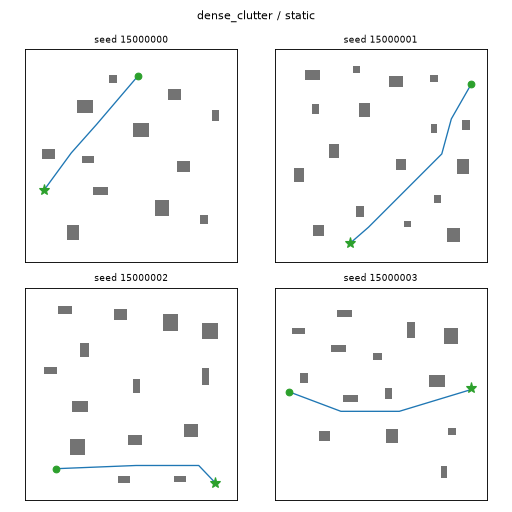

### dense_clutter / dynamic

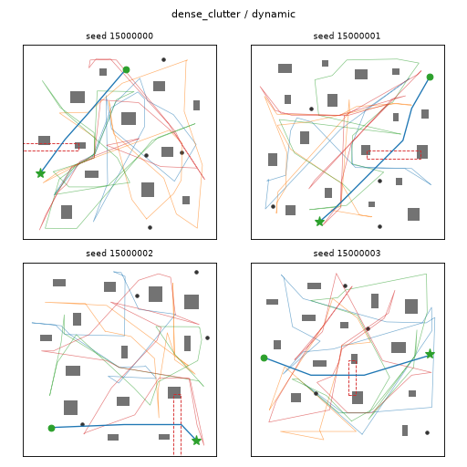

### dense_clutter / trigger_block

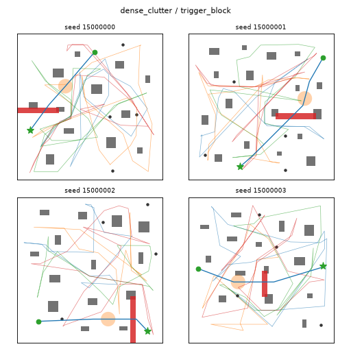

### dense_clutter / trigger_spawn

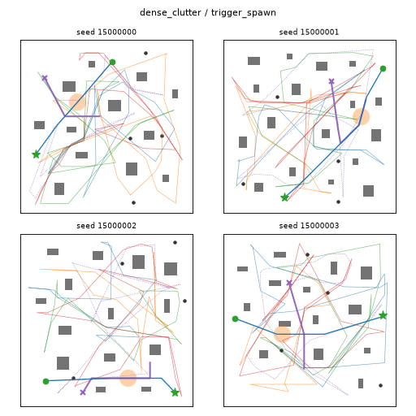

## Approval

Approved by the researcher on 2026-09-19. The approval is recorded in RS_DESIGN ("Approval: map validation report") and in ticket 08. It records the early-leaning trigger fractions and the short-detour blocks as known properties of the suite, not defects, and accepts per-family reporting. This status line and this section were edited by hand after generation; the rest is as generated at `2d0d624`.
