# RS Experiment 1, phase 2: baseline diagnostic

Pre-registration: [[RS_DESIGN]] §6 (phase 2) and §10. Ticket 09. The suite is the one approved in [[RS1_MAP_VALIDATION_REPORT]]. Generated by `experiments/robustsuite/rs2_diagnostic.py`.

- Commit `4c01512`; code tree clean: yes; report regenerated at `6a69dd0`
- Every file in the results folder belongs to this run: the per-cell checkpoints are fingerprinted with the commit, and `provenance.json` holds the manifest and parameter hashes
- Frozen-file manifest verified: yes (`3f4d5938a060`)
- Frozen parameters: `tuned_frozen.json` `c689337740e4`, `random_frozen.json` `97e8cb925b58`
- Generator `rs-gen-0.4`, seed block RS_DIAG (50 seeds), both motion conditions, 500 steps
- Arm `astar_random` (frozen A* + Random-CLF-DR-CBF), frozen SCS controller in every episode
- Trace sidecars: SHA-256 in `traces.sha256` (combined `67934659da93`)

## 0. Reading

Written after the run, from the tables below. The ranking of candidates is for ticket 10 and is
not decided here.

1. **The triggered block is the dominant failure.** The trigger_block cells succeed 0.04–0.31
   (dynamic cells 0.78–0.99). `timeout_at_block` alone is 321 of 2000 episodes (16%), and every
   family has it. At the end of these episodes the robot stands 0.41–0.48 m (5th–95th
   percentile) from the block's face, and 92% of them have not moved in the last 5 s. The QP is
   feasible:
   there is no Random and no DCPError. A* never replans, so the carrot stays past the block.
   Dense clutter suffers least (0.31), which fits its many short-detour blocks (14 / 50,
   [[RS1_MAP_VALIDATION_REPORT]]).
2. **Waiting at the block also causes collisions.** The trigger_block cells have 88 pedestrian
   collisions against 43 in the dynamic cells on the same draws. Most collisions after firing
   are within 1 m of the block (section 6), a median of 140–240 steps after firing. The robot
   stands where the pedestrians walk past the block zone.
3. **Pedestrian collisions are the second mode** (183 episodes, 9%). They grow with narrowness:
   corridors 0.20 and dense clutter 0.12 in the dynamic cell, against 0.01 in open clutter.
   Random's chosen direction satisfies every constraint in only 15% of events pooled, close to
   the ~12% seen on M0.
4. **The triggered spawn is a minor threat.** The spawned pedestrian caused 11 collisions in 500
   episodes. The trigger_spawn cells succeed 2–8 pp below their dynamic cells. Their failures
   split about evenly: 37 come before firing, where the episode is the dynamic cell's, and 34
   after.
5. **DCPError freezes are almost absent:** 2 of 2000 episodes, both mid-route and both ending
   0.56 m from the outer wall. This corrects the ticket 08 expectation. The env's LiDAR reads
   rectangles at their true distance and only the outer wall 0.3 m short, so h < 0 (DCPError)
   happens within 0.6 m of the outer wall, not of every obstacle as [[RS_DESIGN]] §14.1 item 1
   words it. The 0.6 m start clearance keeps starts out of that band. Random on DCPError steps
   (the phase 3 idea) would therefore have almost nothing to act on.
6. **The same standstill without a block.** The static cells lose only 4 episodes (`timeout_stuck`,
   two layouts, each in both motions). The robot is wedged between obstacles off its route.
7. **The M0 anchor matches the known F-D numbers** (0.87 against 0.9025, p 0.36; section 8).
8. **Real time:** p95 step time is about 40–47 ms in every cell, well inside the 100 ms limit
   that candidates must meet.

## 1. Pooled result (20 cells, equal weights, both motions)

| episodes | success | collision | dyn / static / wall | timeout | stuck | SPL | min clear. (mean) | DCPError step rate |
|---|---|---|---|---|---|---|---|---|
| 2000 | 0.719 | 0.102 | 0.097 / 0.005 / 0.000 | 0.178 | 0.346 | 0.626 | 0.178 | 0.0007 |

## 2. Failure modes, ranked by frequency

Each failed episode has exactly one mode, the first that matches in the order of `robustsuite.diagnostic.MODES`. The evidence columns give the share of the mode's episodes that end in a DCPError freeze (≥ 10 steps to the end), that ran Random in their last 10 steps, and whose robot ever moved more than 0.3 m from its start, and that moved less than 0.1 m in their last 50 steps. For episodes whose block fired, the robot's final distance from the block's face is given too.

| rank | mode | episodes | share of all | DCP freeze at end | Random near end | left start | still at end | m from block face at end (fired block) | by family (open_clutter / rooms / aisles / corridors / dense_clutter) | by condition (static / dynamic / trigger_block / trigger_spawn) |
|---|---|---|---|---|---|---|---|---|---|---|
| 1 | `timeout_at_block` | 321 | 0.161 | 0.01 | 0.02 | 1.00 | 0.92 | 0.45 [0.44, 0.45] (n 321) | 65 / 82 / 67 / 67 / 40 | 0 / 0 / 321 / 0 |
| 2 | `collision_dynamic` | 183 | 0.091 | 0.00 | 0.44 | 1.00 | 0.03 | 0.50 [0.41, 1.12] (n 56) | 14 / 22 / 34 / 63 / 50 | 0 / 43 / 88 / 52 |
| 3 | `timeout_stuck` | 36 | 0.018 | 0.00 | 0.06 | 1.00 | 0.50 | 1.45 [1.28, 1.78] (n 14) | 6 / 8 / 5 / 6 / 11 | 4 / 6 / 19 / 7 |
| 4 | `collision_spawned` | 11 | 0.005 | 0.00 | 0.36 | 1.00 | 0.00 | — | 3 / 1 / 3 / 1 / 3 | 0 / 0 / 0 / 11 |
| 5 | `collision_static` | 7 | 0.004 | 0.00 | 0.86 | 1.00 | 0.14 | 0.36 [0.35, 0.39] (n 6) | 0 / 2 / 3 / 1 / 1 | 0 / 0 / 6 / 1 |
| 6 | `collision_block` | 4 | 0.002 | 0.00 | 1.00 | 1.00 | 0.00 | 0.29 [0.28, 0.29] (n 4) | 0 / 1 / 2 / 1 / 0 | 0 / 0 / 4 / 0 |

**Likely mechanisms:**

- `timeout_at_block`: A* never replans, so the carrot stays on the far side of the block. The CLF pulls the robot into the block and the CBF stops it about 0.45 m from the block's face (0.15 m clearance). The QP stays feasible, with no Random and no DCPError, so the robot stands still until the timeout: a CLF–CBF standstill.
- `collision_dynamic`: A pedestrian walks into the robot: pedestrians ignore it, and in a passage the robot has no room to step aside. Random ran in the last second of 44% of these episodes, and it rarely finds a direction that satisfies every constraint (15% of events pooled, section 7). About half of these collisions are in trigger_block cells, where the robot is waiting in front of the block (section 6).
- `timeout_stuck`: The same CLF–CBF standstill without a block: the robot drifts off its route and wedges between obstacles, with the carrot on the far side (rooms / static and dense_clutter / static, renders in section 9). The failing static layouts fail in both motions.
- `collision_spawned`: The spawned pedestrian comes out from behind an occluder 2–3 m from the trigger and LiDAR sees it late. It is rare: 11 of 500 trigger_spawn episodes.
- `collision_static`: The robot touches a layout rectangle, almost always in trigger_block cells and with Random running just before (the 'Random near end' column): the robot is being pushed around in a tight spot next to the block.
- `collision_block`: The robot touches the fired block itself, with Random running just before (every case).

## 3. DCPError freezes per cell

A freeze is a run of ≥ 10 consecutive DCPError steps (h < 0: u = 0, Random not called). Counts are episodes out of each cell's 100.

| cell | any DCPError | DCPError on step 0 | freeze at start | freeze mid-route | freeze to the end | DCPError step rate |
|---|---|---|---|---|---|---|
| open_clutter / static | 0 | 0 | 0 | 0 | 0 | 0.0000 |
| open_clutter / dynamic | 0 | 0 | 0 | 0 | 0 | 0.0000 |
| open_clutter / trigger_block | 1 | 0 | 0 | 1 | 1 | 0.0032 |
| open_clutter / trigger_spawn | 0 | 0 | 0 | 0 | 0 | 0.0000 |
| rooms / static | 0 | 0 | 0 | 0 | 0 | 0.0000 |
| rooms / dynamic | 0 | 0 | 0 | 0 | 0 | 0.0000 |
| rooms / trigger_block | 0 | 0 | 0 | 0 | 0 | 0.0000 |
| rooms / trigger_spawn | 0 | 0 | 0 | 0 | 0 | 0.0000 |
| aisles / static | 0 | 0 | 0 | 0 | 0 | 0.0000 |
| aisles / dynamic | 0 | 0 | 0 | 0 | 0 | 0.0000 |
| aisles / trigger_block | 0 | 0 | 0 | 0 | 0 | 0.0000 |
| aisles / trigger_spawn | 0 | 0 | 0 | 0 | 0 | 0.0000 |
| corridors / static | 0 | 0 | 0 | 0 | 0 | 0.0000 |
| corridors / dynamic | 0 | 0 | 0 | 0 | 0 | 0.0000 |
| corridors / trigger_block | 0 | 0 | 0 | 0 | 0 | 0.0000 |
| corridors / trigger_spawn | 0 | 0 | 0 | 0 | 0 | 0.0000 |
| dense_clutter / static | 0 | 0 | 0 | 0 | 0 | 0.0000 |
| dense_clutter / dynamic | 0 | 0 | 0 | 0 | 0 | 0.0000 |
| dense_clutter / trigger_block | 1 | 0 | 0 | 1 | 1 | 0.0098 |
| dense_clutter / trigger_spawn | 0 | 0 | 0 | 0 | 0 | 0.0000 |

## 4. Per family (its cells weighted equally)

| family | success | collision | dyn / static / wall | timeout | stuck | SPL | min clear. (mean) | modes |
|---|---|---|---|---|---|---|---|---|
| open_clutter | 0.780 | 0.043 | 0.043 / 0.000 / 0.000 | 0.177 | 0.295 | 0.669 | 0.201 | c:dynamic 14, t:at_block 65, t:stuck 6, c:spawned 3 |
| rooms | 0.710 | 0.065 | 0.058 / 0.007 / 0.000 | 0.225 | 0.425 | 0.607 | 0.176 | t:stuck 8, c:dynamic 22, c:static 2, c:block 1, t:at_block 82, c:spawned 1 |
| aisles | 0.715 | 0.105 | 0.092 / 0.013 / 0.000 | 0.180 | 0.360 | 0.635 | 0.197 | c:dynamic 34, c:static 3, c:block 2, t:at_block 67, t:stuck 5, c:spawned 3 |
| corridors | 0.653 | 0.165 | 0.160 / 0.005 / 0.000 | 0.182 | 0.380 | 0.556 | 0.142 | c:dynamic 63, t:stuck 6, c:static 1, c:block 1, t:at_block 67, c:spawned 1 |
| dense_clutter | 0.738 | 0.135 | 0.133 / 0.003 / 0.000 | 0.128 | 0.272 | 0.660 | 0.175 | t:stuck 11, c:dynamic 50, c:static 1, t:at_block 40, c:spawned 3 |

## 5. Per cell

Both motions pooled (100 episodes per cell). Mode abbreviations: `c:` collision, `t:` timeout.

| cell | success | collision | dyn / static / wall | timeout | stuck | SPL | min clear. (mean) | modes |
|---|---|---|---|---|---|---|---|---|
| open_clutter / static | 1.000 | 0.000 | 0.000 / 0.000 / 0.000 | 0.000 | 0.000 | 0.959 | 0.298 | — |
| open_clutter / dynamic | 0.990 | 0.010 | 0.010 / 0.000 / 0.000 | 0.000 | 0.150 | 0.834 | 0.225 | c:dynamic 1 |
| open_clutter / trigger_block | 0.160 | 0.130 | 0.130 / 0.000 / 0.000 | 0.710 | 0.860 | 0.105 | 0.089 | c:dynamic 13, t:at_block 65, t:stuck 6 |
| open_clutter / trigger_spawn | 0.970 | 0.030 | 0.030 / 0.000 / 0.000 | 0.000 | 0.170 | 0.779 | 0.192 | c:spawned 3 |
| rooms / static | 0.980 | 0.000 | 0.000 / 0.000 / 0.000 | 0.020 | 0.080 | 0.910 | 0.247 | t:stuck 2 |
| rooms / dynamic | 0.930 | 0.050 | 0.050 / 0.000 / 0.000 | 0.020 | 0.300 | 0.785 | 0.192 | c:dynamic 5, t:stuck 2 |
| rooms / trigger_block | 0.040 | 0.120 | 0.100 / 0.020 / 0.000 | 0.840 | 0.950 | 0.032 | 0.114 | c:dynamic 10, c:static 1, c:block 1, t:at_block 82, t:stuck 2 |
| rooms / trigger_spawn | 0.890 | 0.090 | 0.080 / 0.010 / 0.000 | 0.020 | 0.370 | 0.699 | 0.151 | c:dynamic 7, c:spawned 1, c:static 1, t:stuck 2 |
| aisles / static | 1.000 | 0.000 | 0.000 / 0.000 / 0.000 | 0.000 | 0.000 | 0.976 | 0.286 | — |
| aisles / dynamic | 0.950 | 0.050 | 0.050 / 0.000 / 0.000 | 0.000 | 0.200 | 0.837 | 0.234 | c:dynamic 5 |
| aisles / trigger_block | 0.040 | 0.250 | 0.200 / 0.050 / 0.000 | 0.710 | 0.920 | 0.024 | 0.077 | c:dynamic 20, c:static 3, c:block 2, t:at_block 67, t:stuck 4 |
| aisles / trigger_spawn | 0.870 | 0.120 | 0.120 / 0.000 / 0.000 | 0.010 | 0.320 | 0.702 | 0.192 | c:dynamic 9, c:spawned 3, t:stuck 1 |
| corridors / static | 1.000 | 0.000 | 0.000 / 0.000 / 0.000 | 0.000 | 0.000 | 0.985 | 0.237 | — |
| corridors / dynamic | 0.780 | 0.200 | 0.200 / 0.000 / 0.000 | 0.020 | 0.320 | 0.632 | 0.136 | c:dynamic 20, t:stuck 2 |
| corridors / trigger_block | 0.070 | 0.240 | 0.220 / 0.020 / 0.000 | 0.690 | 0.850 | 0.034 | 0.075 | c:dynamic 22, c:static 1, c:block 1, t:at_block 67, t:stuck 2 |
| corridors / trigger_spawn | 0.760 | 0.220 | 0.220 / 0.000 / 0.000 | 0.020 | 0.350 | 0.576 | 0.118 | c:dynamic 21, c:spawned 1, t:stuck 2 |
| dense_clutter / static | 0.980 | 0.000 | 0.000 / 0.000 / 0.000 | 0.020 | 0.020 | 0.960 | 0.264 | t:stuck 2 |
| dense_clutter / dynamic | 0.860 | 0.120 | 0.120 / 0.000 / 0.000 | 0.020 | 0.150 | 0.784 | 0.194 | c:dynamic 12, t:stuck 2 |
| dense_clutter / trigger_block | 0.310 | 0.240 | 0.230 / 0.010 / 0.000 | 0.450 | 0.710 | 0.233 | 0.088 | c:dynamic 23, c:static 1, t:at_block 40, t:stuck 5 |
| dense_clutter / trigger_spawn | 0.800 | 0.180 | 0.180 / 0.000 / 0.000 | 0.020 | 0.210 | 0.665 | 0.153 | c:dynamic 15, c:spawned 3, t:stuck 2 |

### By motion condition

| cell | fixed: success / collision / timeout | randomized: success / collision / timeout |
|---|---|---|
| open_clutter / static | 1.00 / 0.00 / 0.00 | 1.00 / 0.00 / 0.00 |
| open_clutter / dynamic | 1.00 / 0.00 / 0.00 | 0.98 / 0.02 / 0.00 |
| open_clutter / trigger_block | 0.16 / 0.16 / 0.68 | 0.16 / 0.10 / 0.74 |
| open_clutter / trigger_spawn | 0.98 / 0.02 / 0.00 | 0.96 / 0.04 / 0.00 |
| rooms / static | 0.98 / 0.00 / 0.02 | 0.98 / 0.00 / 0.02 |
| rooms / dynamic | 0.94 / 0.06 / 0.00 | 0.92 / 0.04 / 0.04 |
| rooms / trigger_block | 0.04 / 0.12 / 0.84 | 0.04 / 0.12 / 0.84 |
| rooms / trigger_spawn | 0.88 / 0.12 / 0.00 | 0.90 / 0.06 / 0.04 |
| aisles / static | 1.00 / 0.00 / 0.00 | 1.00 / 0.00 / 0.00 |
| aisles / dynamic | 0.94 / 0.06 / 0.00 | 0.96 / 0.04 / 0.00 |
| aisles / trigger_block | 0.06 / 0.26 / 0.68 | 0.02 / 0.24 / 0.74 |
| aisles / trigger_spawn | 0.86 / 0.12 / 0.02 | 0.88 / 0.12 / 0.00 |
| corridors / static | 1.00 / 0.00 / 0.00 | 1.00 / 0.00 / 0.00 |
| corridors / dynamic | 0.76 / 0.24 / 0.00 | 0.80 / 0.16 / 0.04 |
| corridors / trigger_block | 0.08 / 0.32 / 0.60 | 0.06 / 0.16 / 0.78 |
| corridors / trigger_spawn | 0.76 / 0.24 / 0.00 | 0.76 / 0.20 / 0.04 |
| dense_clutter / static | 0.98 / 0.00 / 0.02 | 0.98 / 0.00 / 0.02 |
| dense_clutter / dynamic | 0.88 / 0.10 / 0.02 | 0.84 / 0.14 / 0.02 |
| dense_clutter / trigger_block | 0.34 / 0.18 / 0.48 | 0.28 / 0.30 / 0.42 |
| dense_clutter / trigger_spawn | 0.82 / 0.16 / 0.02 | 0.78 / 0.20 / 0.02 |

## 6. Triggered cells: overall and conditional on the trigger having fired

| cell | subset | n | success | collision | dyn / static / wall | timeout | stuck | SPL | min clear. (mean) | infeasible-step rate | Random events / ep | Random margin ≥ 0 | Random margin (median) | DCPError step rate | step ms (mean) | step ms p95 (ep mean) |
|---|---|---|---|---|---|---|---|---|---|---|---|---|---|---|---|---|
| open_clutter / trigger_block | all | 100 | 0.160 | 0.130 | 0.130 / 0.000 / 0.000 | 0.710 | 0.860 | 0.105 | 0.089 | 0.0097 | 4.06 | 0.12 | -0.135 | 0.0032 | 37.2 | 42.1 |
| open_clutter / trigger_block | fired | 90 | 0.067 | 0.144 | 0.144 / 0.000 / 0.000 | 0.789 | 0.944 | 0.042 | 0.084 | 0.0078 | 3.47 | 0.12 | -0.145 | 0.0034 | 37.1 | 41.9 |
| open_clutter / trigger_spawn | all | 100 | 0.970 | 0.030 | 0.030 / 0.000 / 0.000 | 0.000 | 0.170 | 0.779 | 0.192 | 0.0256 | 3.81 | 0.11 | -0.190 | 0.0000 | 38.2 | 43.2 |
| open_clutter / trigger_spawn | fired | 90 | 0.967 | 0.033 | 0.033 / 0.000 / 0.000 | 0.000 | 0.178 | 0.791 | 0.199 | 0.0221 | 3.19 | 0.10 | -0.213 | 0.0000 | 38.2 | 43.1 |
| rooms / trigger_block | all | 100 | 0.040 | 0.120 | 0.100 / 0.020 / 0.000 | 0.840 | 0.950 | 0.032 | 0.114 | 0.0062 | 2.82 | 0.18 | -0.118 | 0.0000 | 36.7 | 41.4 |
| rooms / trigger_block | fired | 92 | 0.022 | 0.076 | 0.054 / 0.022 / 0.000 | 0.902 | 1.000 | 0.018 | 0.120 | 0.0052 | 2.49 | 0.17 | -0.123 | 0.0000 | 36.5 | 41.1 |
| rooms / trigger_spawn | all | 100 | 0.890 | 0.090 | 0.080 / 0.010 / 0.000 | 0.020 | 0.370 | 0.699 | 0.151 | 0.0234 | 4.15 | 0.11 | -0.196 | 0.0000 | 38.2 | 43.2 |
| rooms / trigger_spawn | fired | 92 | 0.946 | 0.043 | 0.033 / 0.011 / 0.000 | 0.011 | 0.370 | 0.743 | 0.160 | 0.0220 | 3.93 | 0.10 | -0.207 | 0.0000 | 38.1 | 43.1 |
| aisles / trigger_block | all | 100 | 0.040 | 0.250 | 0.200 / 0.050 / 0.000 | 0.710 | 0.920 | 0.024 | 0.077 | 0.0054 | 2.28 | 0.22 | -0.086 | 0.0000 | 37.4 | 42.5 |
| aisles / trigger_block | fired | 94 | 0.021 | 0.223 | 0.170 / 0.053 / 0.000 | 0.755 | 0.947 | 0.010 | 0.080 | 0.0050 | 2.22 | 0.22 | -0.088 | 0.0000 | 37.2 | 42.4 |
| aisles / trigger_spawn | all | 100 | 0.870 | 0.120 | 0.120 / 0.000 / 0.000 | 0.010 | 0.320 | 0.702 | 0.192 | 0.0167 | 2.39 | 0.18 | -0.113 | 0.0000 | 39.4 | 47.0 |
| aisles / trigger_spawn | fired | 94 | 0.904 | 0.085 | 0.085 / 0.000 / 0.000 | 0.011 | 0.309 | 0.730 | 0.202 | 0.0160 | 2.34 | 0.17 | -0.117 | 0.0000 | 39.4 | 47.0 |
| corridors / trigger_block | all | 100 | 0.070 | 0.240 | 0.220 / 0.020 / 0.000 | 0.690 | 0.850 | 0.034 | 0.075 | 0.0075 | 2.99 | 0.28 | -0.055 | 0.0000 | 36.1 | 40.5 |
| corridors / trigger_block | fired | 75 | 0.000 | 0.107 | 0.080 / 0.027 / 0.000 | 0.893 | 0.987 | 0.000 | 0.097 | 0.0047 | 2.19 | 0.27 | -0.061 | 0.0000 | 35.6 | 40.1 |
| corridors / trigger_spawn | all | 100 | 0.760 | 0.220 | 0.220 / 0.000 / 0.000 | 0.020 | 0.350 | 0.576 | 0.118 | 0.0205 | 3.49 | 0.28 | -0.061 | 0.0000 | 38.0 | 41.8 |
| corridors / trigger_spawn | fired | 75 | 0.920 | 0.080 | 0.080 / 0.000 / 0.000 | 0.000 | 0.320 | 0.723 | 0.154 | 0.0178 | 2.85 | 0.27 | -0.073 | 0.0000 | 38.2 | 41.8 |
| dense_clutter / trigger_block | all | 100 | 0.310 | 0.240 | 0.230 / 0.010 / 0.000 | 0.450 | 0.710 | 0.233 | 0.088 | 0.0082 | 2.82 | 0.18 | -0.101 | 0.0098 | 39.5 | 45.3 |
| dense_clutter / trigger_block | fired | 74 | 0.189 | 0.230 | 0.216 / 0.014 / 0.000 | 0.581 | 0.865 | 0.122 | 0.078 | 0.0073 | 2.97 | 0.21 | -0.086 | 0.0112 | 38.8 | 44.5 |
| dense_clutter / trigger_spawn | all | 100 | 0.800 | 0.180 | 0.180 / 0.000 / 0.000 | 0.020 | 0.210 | 0.665 | 0.153 | 0.0144 | 2.06 | 0.16 | -0.114 | 0.0000 | 40.9 | 47.1 |
| dense_clutter / trigger_spawn | fired | 74 | 0.851 | 0.149 | 0.149 / 0.000 / 0.000 | 0.000 | 0.189 | 0.705 | 0.165 | 0.0145 | 1.95 | 0.19 | -0.095 | 0.0000 | 40.9 | 47.0 |

### Outcome timing and location relative to the event

Steps from the firing step to the end of the failed episode, and, for collisions after firing, the robot's distance from the trigger centre and from the block's face: median [q1, q3] (n).

| cell | fired rate | failures before firing | failures after firing | failure: steps after firing | collision: steps after firing | collision: m from trigger | collision: m from block face / from spawn start | hit by the spawn / collisions near the block |
|---|---|---|---|---|---|---|---|---|
| open_clutter / trigger_block | 0.90 | 0 | 84 | 449 [404, 470] (n 84) | 207 [169, 254] (n 13) | 1.74 [1.31, 1.89] (n 13) | 0.44 [0.37, 0.48] (n 13) | 11 within 1 m |
| open_clutter / trigger_spawn | 0.90 | 0 | 3 | 37 [36, 80] (n 3) | 37 [36, 80] (n 3) | 1.77 [1.73, 2.81] (n 3) | 2.64 [2.64, 4.11] (n 3) | 3 |
| rooms / trigger_block | 0.92 | 6 | 90 | 429 [364, 453] (n 90) | 171 [156, 199] (n 7) | 2.81 [2.27, 2.91] (n 7) | 0.45 [0.33, 0.53] (n 7) | 7 within 1 m |
| rooms / trigger_spawn | 0.92 | 6 | 5 | 99 [58, 183] (n 5) | 78 [49, 120] (n 4) | 1.91 [0.90, 2.95] (n 4) | 2.78 [2.04, 3.96] (n 4) | 1 |
| aisles / trigger_block | 0.94 | 4 | 92 | 439 [360, 470] (n 92) | 209 [94, 317] (n 21) | 1.65 [1.34, 2.02] (n 21) | 0.48 [0.37, 0.99] (n 21) | 16 within 1 m |
| aisles / trigger_spawn | 0.94 | 4 | 9 | 86 [42, 175] (n 9) | 68 [42, 173] (n 8) | 2.27 [1.05, 3.23] (n 8) | 3.39 [2.67, 5.71] (n 8) | 3 |
| corridors / trigger_block | 0.75 | 18 | 75 | 432 [398, 461] (n 75) | 140 [42, 182] (n 8) | 1.24 [1.15, 1.49] (n 8) | 1.21 [0.35, 2.11] (n 8) | 4 within 1 m |
| corridors / trigger_spawn | 0.75 | 18 | 6 | 54 [30, 110] (n 6) | 54 [30, 110] (n 6) | 1.24 [0.67, 1.42] (n 6) | 2.94 [2.55, 3.23] (n 6) | 1 |
| dense_clutter / trigger_block | 0.74 | 9 | 60 | 438 [389, 461] (n 60) | 238 [44, 383] (n 17) | 1.58 [0.63, 2.46] (n 17) | 0.53 [0.47, 1.23] (n 17) | 12 within 1 m |
| dense_clutter / trigger_spawn | 0.74 | 9 | 11 | 48 [36, 60] (n 11) | 48 [36, 60] (n 11) | 0.73 [0.58, 1.04] (n 11) | 3.03 [2.85, 3.28] (n 11) | 3 |

## 7. Safety layer: infeasibility, Random recovery, step time

Random's margin is the minimum CBC of the direction it selected; ≥ 0 means it found a direction that satisfies every constraint.

Pooled and family rows weight their cells equally; the margin median is the mean of the cells' medians there.

| group | infeasible-step rate | Random events / ep | Random margin ≥ 0 | Random margin (median) | DCPError step rate | step ms (mean) | step ms p95 (ep mean) |
|---|---|---|---|---|---|---|---|
| **pooled** | 0.0150 | 2.61 | 0.15 | -0.166 | 0.0007 | 38.1 | 43.2 |
| **open_clutter** | 0.0209 | 3.47 | 0.10 | -0.216 | 0.0008 | 37.4 | 42.1 |
| **rooms** | 0.0189 | 3.42 | 0.10 | -0.231 | 0.0000 | 37.4 | 42.1 |
| **aisles** | 0.0109 | 1.74 | 0.14 | -0.141 | 0.0000 | 38.8 | 45.1 |
| **corridors** | 0.0142 | 2.64 | 0.26 | -0.106 | 0.0000 | 36.9 | 41.0 |
| **dense_clutter** | 0.0102 | 1.78 | 0.14 | -0.137 | 0.0024 | 40.2 | 45.7 |
| open_clutter / static | 0.0205 | 2.12 | 0.04 | -0.362 | 0.0000 | 36.5 | 40.6 |
| open_clutter / dynamic | 0.0277 | 3.87 | 0.12 | -0.175 | 0.0000 | 37.8 | 42.5 |
| open_clutter / trigger_block | 0.0097 | 4.06 | 0.12 | -0.135 | 0.0032 | 37.2 | 42.1 |
| open_clutter / trigger_spawn | 0.0256 | 3.81 | 0.11 | -0.190 | 0.0000 | 38.2 | 43.2 |
| rooms / static | 0.0230 | 3.02 | 0.01 | -0.383 | 0.0000 | 36.9 | 41.3 |
| rooms / dynamic | 0.0227 | 3.69 | 0.10 | -0.228 | 0.0000 | 37.8 | 42.7 |
| rooms / trigger_block | 0.0062 | 2.82 | 0.18 | -0.118 | 0.0000 | 36.7 | 41.4 |
| rooms / trigger_spawn | 0.0234 | 4.15 | 0.11 | -0.196 | 0.0000 | 38.2 | 43.2 |
| aisles / static | 0.0082 | 0.74 | 0.00 | -0.239 | 0.0000 | 39.2 | 45.1 |
| aisles / dynamic | 0.0134 | 1.54 | 0.16 | -0.124 | 0.0000 | 39.2 | 46.0 |
| aisles / trigger_block | 0.0054 | 2.28 | 0.22 | -0.086 | 0.0000 | 37.4 | 42.5 |
| aisles / trigger_spawn | 0.0167 | 2.39 | 0.18 | -0.113 | 0.0000 | 39.4 | 47.0 |
| corridors / static | 0.0092 | 0.96 | 0.21 | -0.244 | 0.0000 | 35.7 | 39.7 |
| corridors / dynamic | 0.0196 | 3.10 | 0.28 | -0.064 | 0.0000 | 37.7 | 41.9 |
| corridors / trigger_block | 0.0075 | 2.99 | 0.28 | -0.055 | 0.0000 | 36.1 | 40.5 |
| corridors / trigger_spawn | 0.0205 | 3.49 | 0.28 | -0.061 | 0.0000 | 38.0 | 41.8 |
| dense_clutter / static | 0.0063 | 0.70 | 0.09 | -0.212 | 0.0000 | 39.2 | 44.3 |
| dense_clutter / dynamic | 0.0120 | 1.55 | 0.12 | -0.122 | 0.0000 | 41.3 | 46.1 |
| dense_clutter / trigger_block | 0.0082 | 2.82 | 0.18 | -0.101 | 0.0098 | 39.5 | 45.3 |
| dense_clutter / trigger_spawn | 0.0144 | 2.06 | 0.16 | -0.114 | 0.0000 | 40.9 | 47.1 |

## 8. M0 anchor

| episodes | success | collision | dyn / static / wall | timeout | stuck | SPL | min clear. (mean) | modes |
|---|---|---|---|---|---|---|---|---|
| 100 | 0.870 | 0.130 | 0.120 / 0.010 / 0.000 | 0.000 | 0.130 | 0.780 | 0.211 | c:dynamic 12, c:static 1 |

Against the known F-D numbers on M0 (HD0's re-run on HD_FINAL, [[HD0_BASELINES_REPORT]]), with a two-sided Fisher exact test on success (the seeds differ, so the test is unpaired). Consistent means p ≥ 0.05.

The anchor's 95% interval is exact (Clopper–Pearson). With 50–100 anchor episodes the test detects only large departures, about 10 pp or more.

| motion | anchor success | 95% CI | F-D success (HD0) | p | consistent |
|---|---|---|---|---|---|
| fixed | 46/50 = 0.920 | [0.808, 0.978] | 186/200 = 0.9300 | 0.764 | yes |
| randomized | 41/50 = 0.820 | [0.686, 0.914] | 175/200 = 0.8750 | 0.356 | yes |
| pooled | 87/100 = 0.870 | [0.788, 0.929] | 361/400 = 0.9025 | 0.36 | yes |

## 9. The most common failure in each cell

Up to 2 examples of each cell's most common mode: the first in seed order, fixed motion first. Each is a replay of the stored episode, checked equal to its stored trajectory.

Key:
- **Black:** the robot's trajectory. The red × is where it ended.
- **Brown:** the pedestrians. Circles show their final positions (radius 0.3 m), and dots their last 3 s.
- **Orange diamond:** where the trigger fired.
- The rest is as in [[RS1_MAP_VALIDATION_REPORT]]: grey layout, blue route, green start and goal, red block, orange trigger disc, purple spawn.

### open_clutter / dynamic: `collision_dynamic`

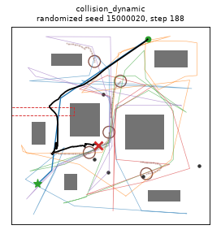

### open_clutter / trigger_block: `timeout_at_block`

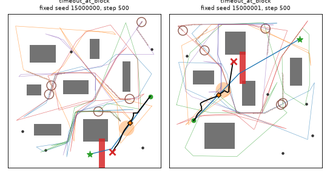

### open_clutter / trigger_spawn: `collision_spawned`

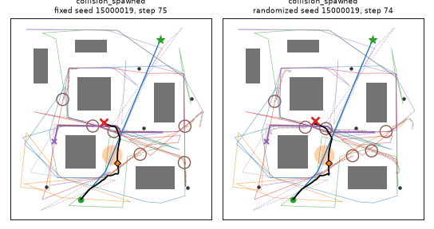

### rooms / static: `timeout_stuck`

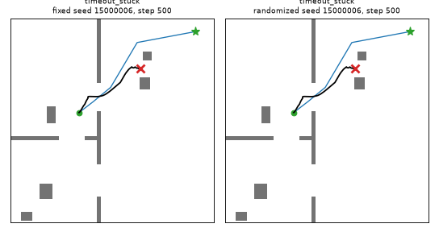

### rooms / dynamic: `collision_dynamic`

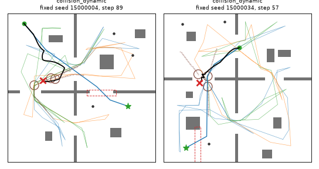

### rooms / trigger_block: `timeout_at_block`

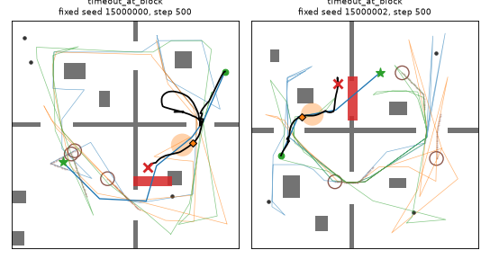

### rooms / trigger_spawn: `collision_dynamic`

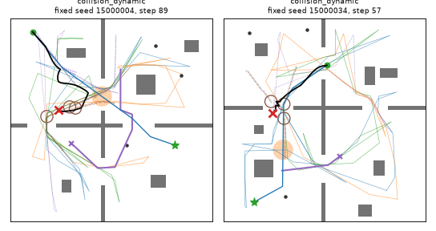

### aisles / dynamic: `collision_dynamic`

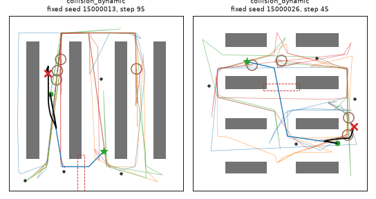

### aisles / trigger_block: `timeout_at_block`

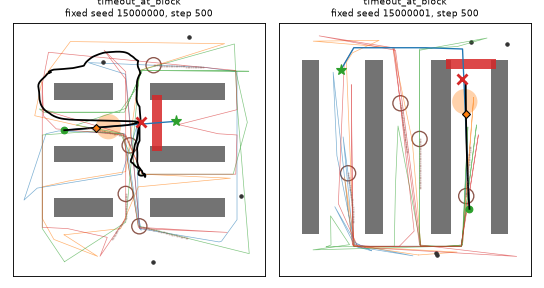

### aisles / trigger_spawn: `collision_dynamic`

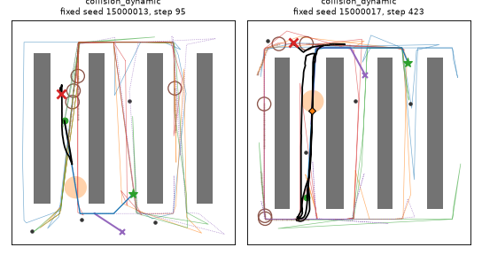

### corridors / dynamic: `collision_dynamic`

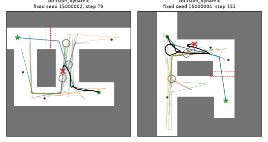

### corridors / trigger_block: `timeout_at_block`

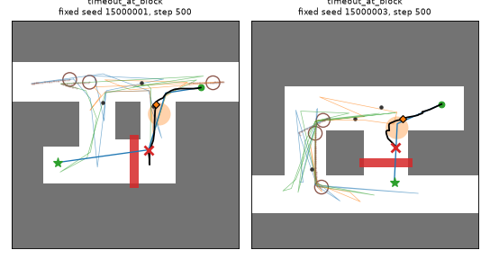

### corridors / trigger_spawn: `collision_dynamic`

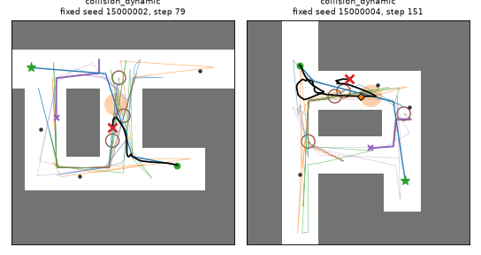

### dense_clutter / static: `timeout_stuck`

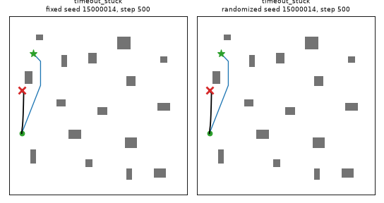

### dense_clutter / dynamic: `collision_dynamic`

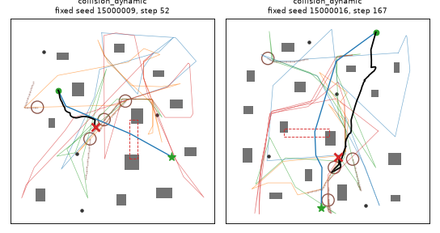

### dense_clutter / trigger_block: `timeout_at_block`

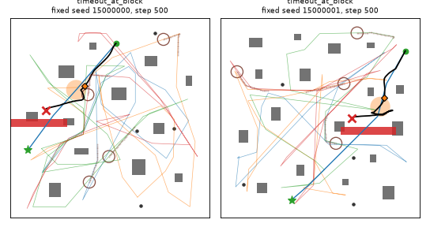

### dense_clutter / trigger_spawn: `collision_dynamic`

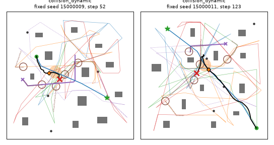

### M0 anchor: `collision_dynamic`

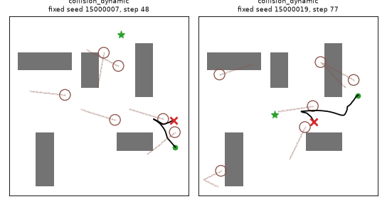
